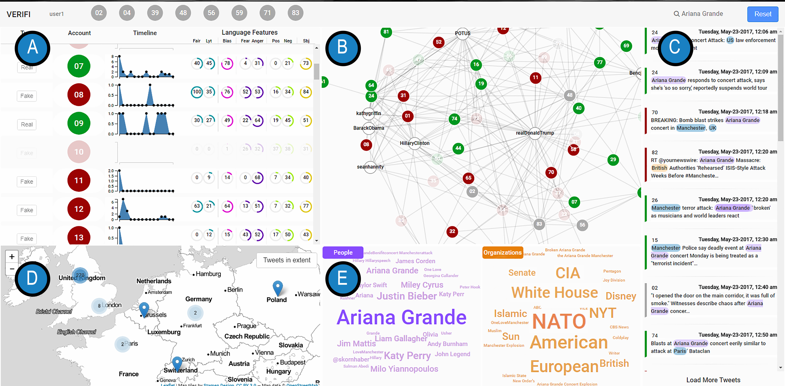
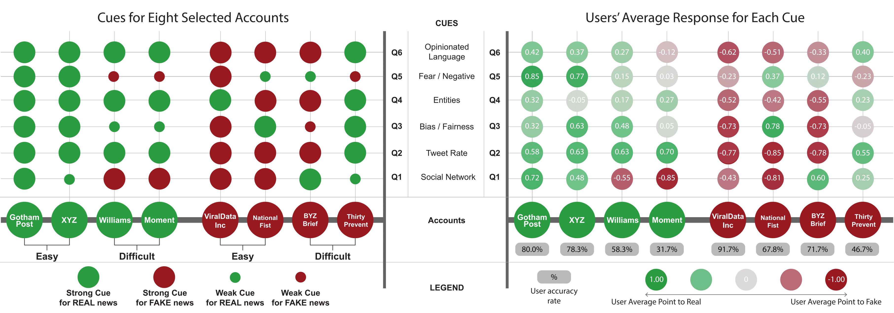
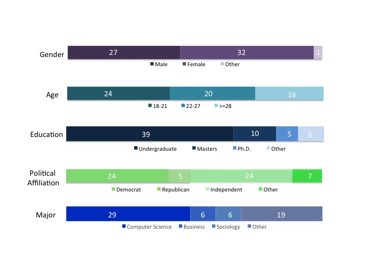

## Paper

Karduni, A., Wesslen, R., Santhanam, S., Cho, I., Volkova, S., Arendt, D., Shaikh, S., and Dou W. (2018). [Can You Verifi This? Studying Uncertainty and Decision-Making about Misinformation in Visual Analytics](./karduni-etal-2018-icwsm.pdf). ICWSM 2018.

~~~
@inproceedings{verifimisinfo,
  title = {Can You Verifi This? Studying Uncertainty and Decision-Making about Misinformation in Visual Analytics},
  author = {Karduni, Alireza and Wesslen, Ryan and Santhanam, Sashank and Cho, Isaac and Volkova, Svitlana and Arendt, Dustin and Shaikh, Samira and Dou, Wenwen}, 
  booktitle = {Proceedings of the 12th International AAAI Conference on Web and Social Media},
  series = {ICWSM '18},
  year = {2018},
  location = {Palo Alto, California}
  }
~~~

## Instructions to run

The code to analyze the study is written in R 3.4.3 or higher. Highly recommend using RStudio 1.1.383 or higher.

Open the file verifi-icwsm-2018.Rproj.

1) R-stream-code: Twitter Streaming API Code to pull the original data ([Rmd](./01-public-api.Rmd) / [HTML](https://htmlpreview.github.io/?https://github.com/wesslen/verifi-icwsm-2018/blob/master/01-public-api.html))
2) Random Forest Model on Language Feature Selection ([Rmd](./02-linguistic-features.Rmd) / [HTML](https://htmlpreview.github.io/?https://github.com/wesslen/verifi-icwsm-2018/blob/master/02-linguistic-features.html))
3) Logistic Regression: Accuracy and Fake Decisions ([Rmd](./03-logistic-regression.Rmd) / [HTML](https://htmlpreview.github.io/?https://github.com/wesslen/verifi-icwsm-2018/blob/master/03-logistic-regression.html))

The code for Verifi is written in python, D3.js, Leaflet.js, and Node.js. Please email <akarduni@uncc.edu> if you are interested in the system. User interaction logs were automatically logged and stored in a local MongoDB database.

## Study

The in-laboratory study was approved by UNC Charlotte Internal Review Board (uncc-irb@uncc.edu), IRB #17-0251.

## Data

| format | Description            |
| ------ | ---------------------- |
| csv    | [User Interaction Logs](./data/userLogs.csv) |
| csv    | [User Responses (Decisions)](./data/userForms.csv) |
| csv    | [Pre-questionnaire](./data/pretest.csv) |
| csv    | [Account Twitter IDs](./data/accounts.csv) |

Account information is provided in accordance to Twitter's [Terms of Service](https://developer.twitter.com/en/developer-terms/agreement-and-policy), i.e., only Twitter account ID's provided. For the original dataset, please email me <rwesslen@uncc.edu>. The data can only be used for research purposes only!

All user-level data are anonymized. Use user-id for matching.

## Figures

### Verifi

The Verifi interface: Account View (A), Social Network View (B), Tweet Panel (C), Map View (D), and Entity Word Cloud (E). The interface can be accessed at <https://verifi.herokuapp.com>.

When accessing the heroku app, Google Chrome is highly recommended. You may need to modify your zoom depending on your monitor size.

### Language Features

Top 20 most predictive language features of Fake and Real news outlets as measured by each feature’s average  effect  on  Accuracy.  ‘t’  prefix  indicates  the  feature  is normalized by the account’s tweet count and ‘n’ indicates normalization by the account’s word count (summed across all tweets). Features with borders are included in Verifi.

### User Study

#### Accounts Selected for User Decisions

Eight accounts with masked account names. Background colors indicate real (green) and fake (red). Accounts were masked as requested by one of authors' institutions. 

Ground truth (real vs fake) labels were selected from third party sources. Fake news accounts came from one of two sources: [Propaganda](http://www.propornot.com/p/the-list.html) and [Satire, Hoax, and Click Bait](https://web.archive.org/web/20171021092249/http://www.fakenewswatch.com/). Since our study, the original source of the Satire-Hoax-ClickBait accounts is no longer online, hence our link is to the Wayback Machine link from late 2017.

Real news accounts came from one of two sources: [Business Insider](http://www.businessinsider.com/most-and-least-trusted-news-outlets-in-america-2017-3), [Forbes](https://www.forbes.com/sites/berlinschoolofcreativeleadership/2017/02/01/10-journalism-brands-where-you-will-find-real-facts-rather-than-alternative-facts/2/#2a33766c6014)

For the 82 accounts selected for our study, we manually reviewed the accounts to get a variety as well as ensure basic rules (e.g., enough tweets, English tweets, profile had not been deleted or public at the time of the study).

[Account Twitter IDs](./data/accounts.csv) provides the Twitter profile ID's as well as the third-party labels.

#### Truth Table

Available cues for selected accounts (column) and users' response regarding the importance of these cues (row, Q1-Q6). Left: Shows each of the eight selected accounts as well as the cues available for each of them. Right: Shows average of importance for each cue per account based on participants' responses. Values in gray circles below each account name show average accuracy for predicting that account correctly. The left figure is purely based on the (conflicting) information presented in the cues and is independent from user responses. The right figure based on the user responses on the importance of each cue coincides with the information in the left table.

#### Logistic Regression to Explain User Predictions (Accuracy and Fake)

Log odds ratios for each independent variable in two logistic regressions. The Accuracy column is 1 = Correct, 0 = Incorrect Decision. The Fake column is the user's prediction: 1 = Fake, 0 = Real. The `@accounts` variables use `@XYZ` as the reference level and the Group variables use the Control Group as the reference level.

#### Study Demographics

